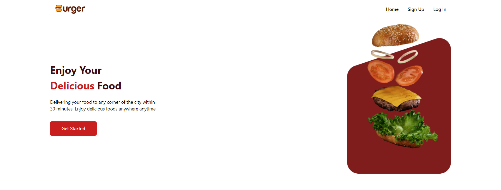

# Burgero: Deliciously Crafted Django Backend for Your Restaurant Site

Welcome to **Burgero**, where savory bites meet sophisticated Django backend architecture! 🍔🔥

**Live Link:** [burgero.onrender.com](https://burgero.onrender.com)

## Overview
Bolster your restaurant's online presence with **Burgero**, a feature-packed Django backend designed to power your mouth-watering restaurant site. From menu management to order processing, Burgero streamlines the backend operations, allowing you to focus on what you do best – serving delectable burgers!

## Key Features
- **🛒 Cart Management:** Effortlessly update and organize your cart items, complete with mouthwatering descriptions and tempting images.
- **💳 Wallet Management:** Deposit and Pay from built-in wallet inside the platform, making your journey smooth and secure.
- **📋 Order Processing:** Seamlessly handle online orders, ensuring a smooth flow from customer request to the kitchen, all within the robust Django framework.
- **📈 Analytics Dashboard:** Gain valuable insights into customer preferences, order history, and payment overview generation with a built-in analytics dashboard.
- **🔐 User Authentication:** Securely manage user accounts, providing a personalized experience for customers and staff alike.

## Getting Started
1. **Clone the repository:**
   ```bash
   git clone https://github.com/yourusername/burgeo.git

2. **Install dependencies:**
   ```bash
   pip install -r requirements.txt
   ```
3. **Set up your database:**
   ```bash
   python manage.py migrate
   ```
4. **Create a superuser account:**
   ```bash
   python manage.py createsuperuser
   ```
5. **Run the development server:**
   ```bash
   python manage.py runserver
   ```

Now, Visit http://localhost:8000/admin/ to start managing your restaurant's data or explore the API at http://localhost:8000/api/.